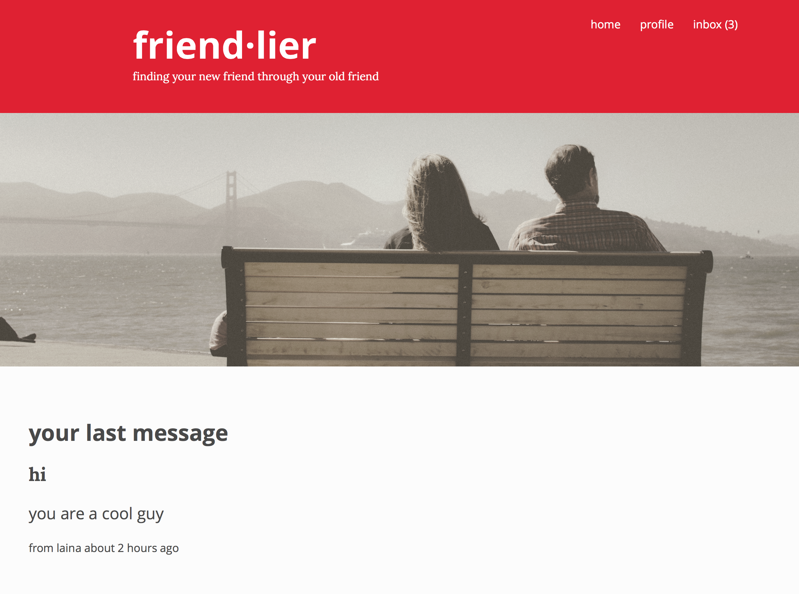

# Friendlier

[See a demo](http://friendlier.herokuapp.com/)

Dating is hard and awkward.  There should be a better way to make the first date less stressful and more fun.  Friendlier is a new dating site that hopes to resolve those issues.  With Friendlier, potential dates are vetted by your friend before you ever meet them.  Now you will know that each first date you go on has already been approved, leaving you with less to worry about and other things to focus on.

## Features

* CRUD
* Image uploads for user profiles (paperclip gem)
* Internal mailbox to send and receive messages (mailboxer gem)

## Design

Home page with navbar.  Unread messages in inbox displayed in navbar.  Most recent message displayed below picture.

Each user has a profile where they can upload their image and your friend can write three of your best qualities.

Users can receive and send messages from any user.  Messages can be seen in your inbox and each conversation is viewed on the same page.

